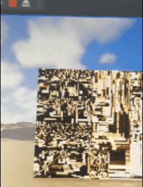
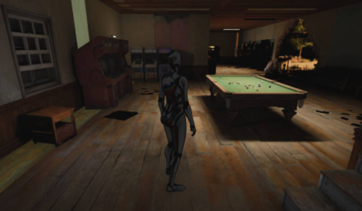
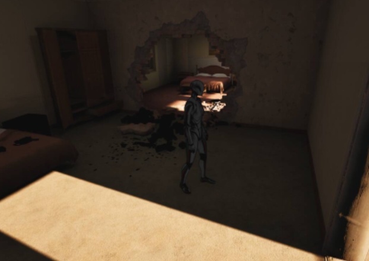
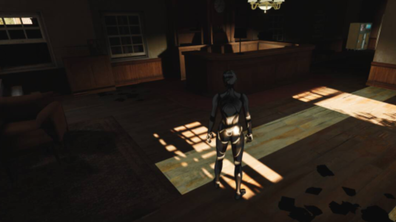

## 赛题背景

### 动态光照的性能与存储的缺点

- 虽然实时光线追踪的效果好，但性能开销太大。因此，业界普遍采用烘焙的方案：提前将光照结果烘焙为 Lightmap，即光照贴图，运行时仅做贴图采样，从而以极低的计算成本获得高质量光照效果，但为了支持一天内光照变化，需要存储多套 Lightmap，就算使用 BC / ASTC 等传统硬件纹理压缩，总体体积依然非常庞大。
- 本次比赛就算为了解决这个问题，核心思路是：使用神经网络对光照贴图进行压缩，用模型参数替代大规模贴图数据，且支持连续时间变化。
- 本次比赛使用暗区突围的真实数据。

---

## 比赛要求

**赛题一**：设计算法，给定光照贴图的空间坐标与时间 (u, v, t)，输出光照贴图中对应的颜色 (R, G, B)

**赛题二**：将设计的算法整合入UE引擎

**详细要求**：

1. 游戏引擎的特性要求支持随机访问，任意 (u, v, t) 都需要能直接推理得到结果，而非整张贴图还原
2. 只能使用 (u, v, t) 作为输入，不允许引入法线、位置、材质等信息，本质上要求模型只凭坐标恢复光照
3. 评分方式：图片质量（PSNR 、 SSIM 、 LPIPS）、性能（推理时间）与压缩比（模型体积/原图体积）。赛题二会有额外的评分标准比如自动跑图的卡顿次数等

## 赛题一比赛过程

之前没接触过游戏引擎开发，也不了解游戏的渲染原理，但挺感兴趣的，于是先看了 Games101 课程学习了一些图形学基础知识，也上网了解了一些游戏渲染原理，然后就开始了这次比赛尝试。

### 尝试一：多分辨率哈希编码

由于是第一次接触这个领域，所以我先参考了官方提供的资料以及在网上查找有关的论文，发现有Instant-NGP、NTC等处理类似问题的方案，我首先尝试使用类似Instant-NGP的方案（多分辨率哈希编码），核心思想是：不直接把坐标交给 MLP，而是先将坐标映射到一组多尺度的特征表中，再由 MLP 推理结果。这个方法一般用于 3D 重建等场景，我把时间 t 也当做空间三维中的一维了。

具体方法：

1. **多分辨率网格**
   - 对输入坐标空间 (u, v, t)，构建多个哈希表（从意义上理解对应不同分辨率），低分辨率层可以捕捉整体、低频变化，高分辨率层可以捕捉局部、高频细节
   - 每一层可以理解为一个虚拟的网格，但分辨率不同
2. **哈希表存储特征**
   - 由于完整的高分辨率网格的存储开销太大，所以Instant-NGP 使用哈希表来近似存储每个网格顶点的特征向量（特征向量是可训练的参数）：
     - 将网格顶点坐标通过哈希函数映射到固定大小的表
     - 多个顶点在同一张表里可能发生冲突，但是多张表的结果最后会拼起来传入小型 MLP ，所以可以消除哈希冲突的歧义
   - 每个表项存储一个可训练的低维特征向量
3. **特征拼接 + 小型 MLP**
   - 对于一个输入 (u, v, t)，在每个分辨率层中：
     - 计算其所在的网格位置，读取各个相邻顶点的哈希特征
     - 通过插值获得当前层的特征向量
     - 将所有分辨率层的特征向量拼接，再拼接真实坐标与时间(u, v, t)
   - 传入一个非常小的 MLP，输出 (R, G, B)

由于大部分表达能力已经被保存到哈希特征中，即便MLP只有几层，也能有很好的效果。

这个方法毕竟是开源方案，在赛题一的得分没达到前二十名（具体多少也不知道，排行榜只展示前二十。），分析各指标得分后发现是压缩比在拖后腿，也就是哈希表的空间占用过大，我也尝试过减少哈希表数量，但是质量分数又相应下降了。

### 尝试二：NTC（Neural Temporal Lightmap Compress）

这也是查到的论文方法之一，在此之上我进行了多个修改。NTC 的原理与多分辨率哈希有些相似，也有多分辨率网格，但是是真实的网格，不使用哈希。另外，我在此尝试的是二维网格而不是三维。

**大概流程**：

输入(u, v, t) → UV位置编码 → 在两种分辨率网格中查询特征值，插值并拼接得到最终特征值→ 将特征值与(u, v, t)拼接 → 传入贴图对应的小MLP，推理得到RGB。

#### 持续优化的过程

在验证完方法的可行性后，开始了持续的优化。不得不感叹一下，在AI的辅助下，想法的提出→试验→评估流程加速了N倍，方案可以快速迭代。

1. **位置编码**：在一些论文中了解到位置编码，即：原先是将 `(u, v, t)` 与特征向量拼接作为 MLP 的输入，但是这样模型没那么容易学习到图像的高频信息，所以使用 $\sin(2^k \pi p)$ 和 $\cos(2^k \pi p)$ 将位置 p 映射到高维空间（取2个 k 值，2维 xy → 2x2x2=8维），实验发现图像质量分数确实有所提升。
2. 采用**多分辨率特征网格**，实验发现最佳配置是：分辨率分别是原始的1/2和1/4，每个网格点的特征维度是4维，两层共8维。
3. **激活函数选择**：在一些论文中了解到 SIREN 激活函数(其实就是正弦)适合拟合高频信息，我把官方的原始数据转成图片，发现光照贴图大部分都是高频信息，于是将其应用于 MLP 的一个隐藏层，图像质量分数再次提升。
4. **创新**——时间多头：我在思考神经网络的大小与信息容量时，突然想到：虽然一个贴图在不同时间烘焙的光照贴图长得不一样，但是他们有结构上的相似性，我想让模型的一部分专注于学习图像的结构特征，另一小部分专注于学习光照变化，于是我把 MLP 的最后 2 层变成 24*2 个平行的层，每个时间使用对应的层进行计算，这样做有 2 个极大的优点：
   1. 模型更高效储存光照信息，从神经网络的意义去理解，分配了更多的空间储存结构性特征，且不同时间点的光照信息互不影响，单独储存。
   2. 大幅度减小插值计算量：在非整点时间时，传统方法需要使用完整mlp推理2次，然后插值得到中间时刻的 RGB ，而新的方法只需要推理1次，然后复用第一次推理的倒数第三层结果进行1次前向传播，计算时间几乎是原来的1/2。使用这个方法后，分数大幅提升。
5. **细节优化**：观察不同时间的光照贴图，发现有些时刻图像整体特别亮，有些时刻图像特别暗，如果对24张光照贴图的像素进行统一的归一化，很容易丢失暗部的信息。所以分别对早晚的贴图进行归一化，每个时刻独立计算颜色最大值，用于在训练时将每个时刻的 RGB 单独归一化，在推理时乘回去。（赛后复盘得知其实可以用 log 来处理这个问题）
6. **加权损失函数设计**：由于评估指标中的PSNR是分块PSNR（被切成一片片评估，最后取平均），公式是 PSNR = $10 \times \log\_{10}(\text{max}^2 / \text{MSE})$，所以亮度较低的块会拉低整体分数，于是在训练中模拟这一评估逻辑：每个256\*256的块损失函数的weight =(全局缩放系数/该块局部最大值)^2，可以更好的重建暗部细节，防止在 HDR 图片下模型训练只关注亮的像素而忽略暗部细节。
7. **多次调参**：尝试过各种参数组合，并且抽取少量图片进行训练并比较得分：特征向量的维度、网格分辨率、神经网络层数组合，最后得到目前的最优结果。
8. 使用混合精度训练：用 FP16 计算，FP32 存参数，加速训练过程

这些优化是在比赛的前大部分时间里完成的，赛题一的排名来到了前5，由于还有赛题二（整合进 UE5 ），而且平时还要上课，时间紧迫，所以不能继续优化了。

---

## 赛题二比赛过程

由于对赛题二的工程难度的错误估计，我没分配好时间，导致只剩下3周时我才开始进行赛题二。由于时间不够深入代码，所以大部分工作都指挥 AI 完成，这里记录一下赛题二的完成过程、如何利用 AI 辅助完成这个工程、一些遇到的问题、我的解决方案，以及最后令人遗憾的大乌龙 = =。

### 配置与测试

花了一天的时间在腾讯的太湖平台下载了暗区突围的场景资源和 UE 代码（为此专门买了硬盘扩容，现在还升值了..），第一次尝试编译如此庞大的东西，花了好几个小时。

#### 小幅度落地算法

经过环境的配置、编译源码，我觉得我还是太小瞧赛题二的工程难度了，以前没接触过引擎开发、Shader，而且直接改源码每次编译时间太久了，于是在初步了解 UE 的渲染原理后，我决定先不改 UE 源码，而是尝试用插件的方式来实现算法（目标是用插件的方式把一张光照贴图的24小时连续渲染出来），我的思路是一步步用 AI 辅助完成。

**过程**：

1. 读取模型文件并打印参数，写 Shader 尝试渲染一个正方形画面
1. 发现渲染出来的图片颜色混乱，于是让AI写了与 Python 版本代码产生的数据进行对拍的程序，发现是C++解析的时候一层模型权重顺序读错了。
1. 为了调试方便，减少资源绑定，重构了 Buffer 结构，把所有模型参数都合并到一个 StructuredBuffer 里，头部记录偏移量（其实这是错误的决定，比赛完复盘才发现这个方案在后期大大增加了调试难度）
1. 发现渲染出来的图的颜色很奇怪，于是我想到直接把模型推理数据当做颜色渲染出来（数据的特征和原图的结构也是相似的），发现了坐标没除以 2 。
1. 但渲染仍然有问题，没找到问题根源，连 AI 也没找出问题，后来得知游戏引擎开发中，有个工具叫 Renderdoc （可以查看渲染管线的每个步骤的数据），所以我细化了渲染过程的检查，每一步的数据都和 Python 版本对比，找到根本原因是 Head 层参数写错：因为 Python 在导出模型参数时，文件前面缺少了部分反序列化的信息（一些偏移量等），导致解析有问题。这就是上文提到的那个错误决定造成的问题。
1. 其他优化：尝试时间插值；尝试使用 RDG 进行推理调度 （UE 里自动管理资源生命周期和状态的API，正式整合算法肯定要用，所以也在这里尝试）

还有很多没列举出来的陌生领域的试错过程，比如GPU是高度并行，没有CPU那样的函数调用栈，所以 Shader 编译后所有函数都会自动展开，编写不当就导致编译非常非常耗时间。

测试效果如下：

### 改 UE 源码，正式整合算法

**过程**：

1. 学习必备知识：了解渲染管线大概流程是：CPU准备数据->GPU渲染->屏幕输出；每个场景的物体都有材质，它对应的着色器根据顶点、法线、光照信息等计算每个像素的颜色，而我们要做的就是把光照信息从 Lightmap 直接采样得到 RGB 改为用 Shader 运行神经网络推理得到 RGB
1. 让 AI 根据第一版代码来改源码，由于第一次实验把坑都踩过了，所以这个过程的 bug 比第一版代码少了很多，也节省了多次编译代码测试方案所花费的时间，证明这个实践策略是对的
1. 由于时间分配问题，截止时间前两天才测试完毕并第一次提交 diff 代码，由于提交人数较多，每天好像只能出 2 次评分结果。
1. 赛题二的得分比想象中低了很多，尤其是质量分数，远不如赛题一的 Python 版分数，但是在实机上看起来好像没什么毛病，那时已经天黑，比赛还有几个小时就结束了，苦苦排查也没找出问题，一度以为是测评出问题了。
1. 比赛结束了，第二天我继续找问题，突然想起当时 AI 提醒过我 UE 的 UV 坐标是和 Pytorch 相反的（UE 里 UV 坐标原点在左下，Pytorch 原点在左上），当时已经按照这个方法改了，但是后来以为还没改，于是又反转了一次坐标，然后坐标轴就真的反了... 检查了图片和代码，发现确实如此，由于场景的许多贴图都具备一些对称性，肉眼很难看出来，然而通过公式计算像素差异的成绩差距会很大，所以当时怎么也没想到是坐标问题。（我把一些当时的截图贴在下面了，看起来真的很完美）
1. 几天后总成绩公布，赛题一分数第四，总分数第十四。根据分数以及前3名的开源方法估算了一下，如果没有写反坐标，应该是能前四的

## 总结与体会

- 对于赛题一：
  - 以前只学习过神经网络的一些理论知识而没有实践过，这次是一次不错的尝试机会，实践加深了我对神经网络的理解
  - 这次优化算法的过程其实和打 ACM 很像，算法竞赛锻炼了思维能力，也让我积累了很多经验，比如如何分析问题、如何思考&解决问题；另外，AI 也让验证过程大幅提速，合理使用 AI 可以高效验证多种策略。我认为这些因素是我在赛题一取得第四名的关键
- 对于赛题二：
  - 接触一个新领域，或者是完成大点的工程，就算有AI也得人来一步步控制实现，不然调试很困难。如果这次没有用小幅度落地探索的策略，我也许无法完赛，当时比赛Q群里群友对于引擎开发的调试也是一片哀嚎
  - 这是我第一次使用 AI 完成这种大工程，这个比赛过程让我积累了很多 AI 辅助开发、调试的技巧，比如上下文控制、提示词习惯之类的，当时 Agent 才刚刚起步，Claude Code 也刚推出不久，远没有现在这么成熟，现在的 Harness 工程在当时全靠人肉搬运，一些记忆工程也需要自己探索
  - 如果是现在进行比赛，对于这种陌生领域，就可以使用 context7 这种 mcp 来减少幻觉带来的错误，让 ai 查阅官方文档后再写（当然也不止是 Agent 使用问题，还有其他因素 比如时间分配太少了）
